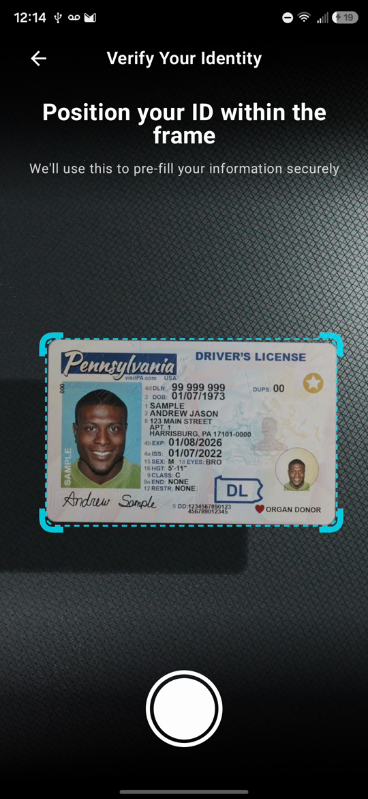

# Card Detector

Detect, track, and crop cards in an Android camera or video feed with Jetpack Compose, CameraX, and on-device YOLO inference. Use the resulting bitmap in your own OCR or document-processing pipeline. Temporal lock-on means visual stability; it does not establish document authenticity or identity.

**[Documentation website](https://lambdawalker.github.io/android.apexfission.carddetector/)** · **[Installation](IMPORT.md)** · **[AI integration](docs/agents/index.md)** · **[Demo catalog](docs/agents/demos.md)**

**Versioned guides:** [English](https://lambdawalker.github.io/android.apexfission.carddetector/en/) · [Español](https://lambdawalker.github.io/android.apexfission.carddetector/es/). Select the module and release independently; installation pages show the confirmed destinations for that exact version.

## See it in motion

[](https://lambdawalker.github.io/android.apexfission.carddetector/demos/)

Watch the [screen recording with playback controls](https://lambdawalker.github.io/android.apexfission.carddetector/demos/), or [download the original recording](https://github.com/lambdawalker/android.apexfission.carddetector/raw/main/docs/demo.mp4). This September 17, 2026 recording illustrates the moving guide; its capture commit/device configuration is unknown. It is not a benchmark or current-release test.

## Integrate

Use the confirmed coordinates generated in [IMPORT.md](IMPORT.md). Choose `core` for your own compatible model or `sentinel-card-model` for the bundled model and pinned compatible core. The [complete quickstart](docs/agents/quickstart.md) includes imports, permission handling, and explicit bitmap cleanup.

- Live camera: `CardDetectorLite`.
- Recorded video: `CardTrackingSimulator`.
- Presentation: `IdCaptureOverlay`, custom scoped controls, and animation helpers.
- Configuration: detector/camera presets, preprocessing, and `CardValidator`.
- Without Compose: `buildCardDetector` and synchronous `track` overloads.

Every delivered callback bitmap belongs to the host. Recycle after final use. Callbacks run on worker threads and can skip pending detections; capture uses a retained best image. Read [ownership and lifecycle](docs/agents/concepts.md).

## Repository

| Module | Purpose |
| --- | --- |
| `:carddetector` | Core, camera/video adapters, tracking, overlays, optional OCR wrapper |
| `:tfmodel` | Sentinel model assets and `ModelCatalog.TfLite` extensions |
| `:app` | Live camera, video simulation, and minimal documentation quickstart |

YOLO and coordinates come from Maven Central. No sibling checkouts or submodules are required. Hydrate media with `git lfs pull`.

```bash
./gradlew :carddetector:testDebugUnitTest :app:assembleDebug
python3 -m pip install -r scripts/requirements-publishing.txt
cd sites
npm ci
npm run check
```

The existing unversioned guides describe **main development source**. The versioned site preserves release-specific guides and source links in English and Spanish. Published installation facts come independently from confirmed release metadata. See [maintenance](docs/maintenance.md), [coverage](docs/coverage.md), and the [release runbook](docs/releases.md). Apache-2.0; see [LICENSE](LICENSE).

## Independent releases

Use **Publish card-detector** or **Publish card-detector-model**, then select the destination repository. Each module/destination has its own version and release history; model releases pin a compatible published core. Configure destinations in `publishing/repositories.yml` and use the [Textual environment setup wizard](docs/releases.md#interactive-environment-setup) to create or update their GitHub settings. See [the release runbook](docs/releases.md).
